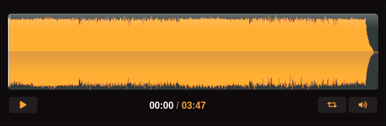
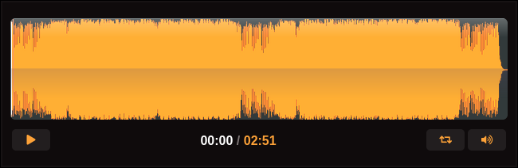

# Chimiquizz Desktop

> A game with more formulas and more chemical names. 


## Why I made this game
A few weeks ago, I made [Chimiquizz], but for Web, using JavaScript. I was not satisfied with the result, as I wanted to develop the game in Rust for each platform.


## Tools
I used [macroquad] as well as [ears], a simple library for audio management (in my case, for music).


## Issues encountered

### Why there is no music on Windows version
[ears] works differently on Windows. You need an external compiler from msys2, but I didn't manage to set it up.

Therefore, I decided to use it only on Linux and remove the musics on Windows.

Another issue that I found with ears was audio saturation. If the music you choose is not compressed enough, you can hear crackling noises (it will saturate).



This music will not saturate.




This one will (the waveform reaches the "edges").

This is the reason why the choice of music was quite limited.


### Modules and includes in Rust
As I am a beginner in Rust, I still have a hard time understanding how to include external files. For instance, I tried to set `AssetsManager` struct in a separate file, like `assets_manager.rs`, which was used in `main.rs` and `functions.rs`. I have not found a way to include this file.


## Build

You can find the game on itch.io, but if you want to download the project and build it, here are the instructions.


### Windows
```bash
cargo build --target x86_64-pc-windows-gnu
```


### Linux
You need first to install packages for ears.

```bash
# On Ubuntu, Linux Mint, etc.
sudo apt install libopenal-dev libsndfile1-dev

# On Arch Linux and Manjaro
sudo pacman -S openal libsndfile

cargo build
```


If you want to compile from Linux to Windows, you have to install Mingw64 first.


```bash
# On Ubuntu, Linux Mint, etc.
sudo apt-get install gcc-mingw-w64

# On Arch Linux and Manjaro
sudo pacman -S mingw-w64-gcc

rustup target add x86_64-pc-windows-gnu
cargo build --target x86_64-pc-windows-gnu
```


## Add new formulas and chemical names

To do so, refer to [this file].


## License

This project is under MIT License (you can read the [LICENSE] file to understand the details).

In addition to the license conditions, you have to credit the artists who made the sound effects and the musics, which I did in the file [credits.txt].

<!--- References --->
[Chimiquizz]: https://github.com/Limulos/Chimiquizz
[macroquad]: https://github.com/not-fl3/macroquad
[ears]: https://github.com/nickbrowne/ears
[this file]: assets/data/formatting.md
[LICENSE]: LICENSE
[credits.txt]: assets/credits.txt